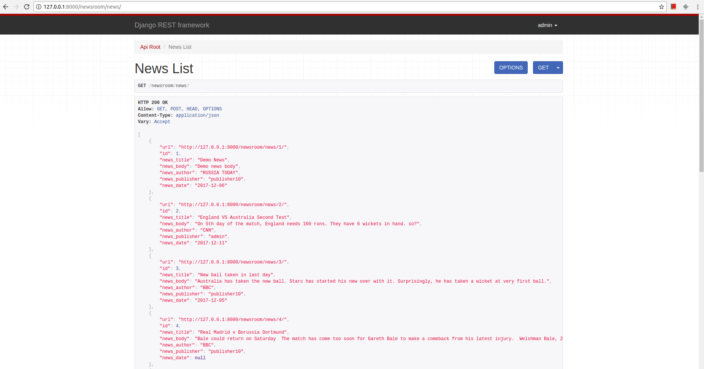

Newsroom
========

A web application for storing and managing news stories.
This branch is developed using Django REST Framework (DRF)

## Milestones

### - [x] Phase 1 (Completed)

   - Necessary package installation
   
   - Database creation
   
   - Sign up and login system for users

   - A page to list all stored news

   - A page to create new news

### - [x] Phase 2 (Completed) 

   - Add edit and delete functinoalities for each news

   - Delete function should include confirmation alert

### - [x] Phase 3 (Running)
 
   - Django Rest Framework
   
## Software Used

The following environment are used to develop the application:

- **OS** : Ubuntu 16.04 (64 bit)
- **IDE** : PyCharm Professional (Version: 2017.3)
- **Python** : 2.7 (64 bit)
- **Django** : 1.11
- **Database** : SQLite
- **Django REST Framework** : 3.7.3

### Necessary Package Installation

- Install virtual environment

		$ python virtualenv venv

- Activate virtual environment (Change it based on your OS)

		$ source venv/bin/activate

- Install necessary packages included in requirements.txt

		$ pip install -r webapp/requirements.txt

### To Run the Application

- Activate virtual environment (if not activated)

		$ source venv/bin/activate

- Run the `application.py`

		$ python manage.py runserver
		
### Database migration

- Create migration

		$ python manage.py makemigrations

- Run migration

		$ python manage.py migrate
		
### Super User 

- Create super user

		$ python manage.py createsuperuser
